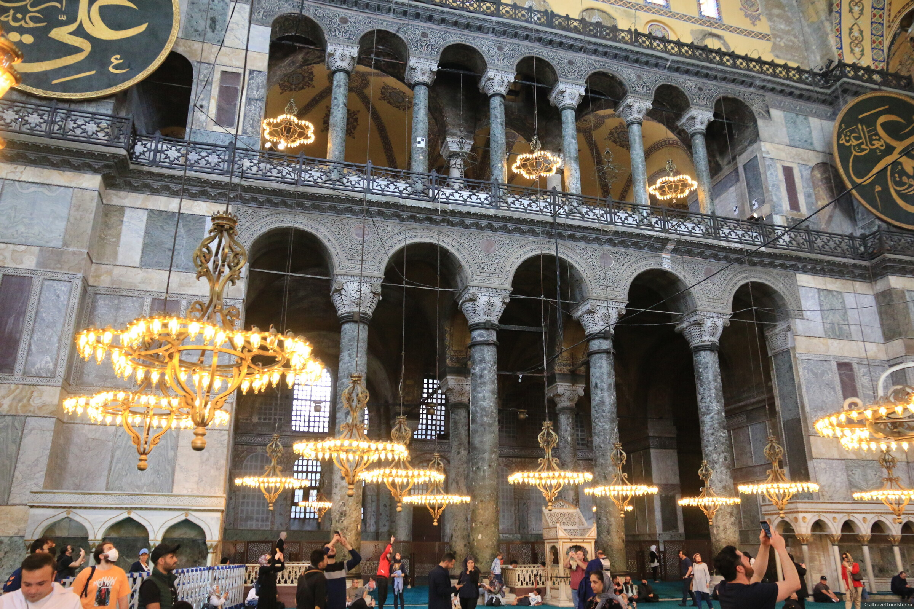

# Собор Парижской Богоматери — 2

  
  
   

[элементы собора](https://yandex.ru/images/search?from=tabbar&isize=large&lr=45&aabrnd=475779672&nomisspell=1&text=%D1%81%D0%BE%D0%B1%D0%BE%D1%80%20%D0%BF%D0%B0%D1%80%D0%B8%D0%B6%D1%81%D0%BA%D0%BE%D0%B9%20%D0%B1%D0%BE%D0%B3%D0%BE%D0%BC%D0%B0%D1%82%D0%B5%D1%80%D0%B8%20%D1%8D%D0%BB%D0%B5%D0%BC%D0%B5%D0%BD%D1%82%D1%8B)

А если мы войдем в самый собор, то кто снес колоссальное изображение святого Христофора, так же славившееся среди других статуй, как славился большой зал *Дворца правосудия* среди других зал и *острие колокольни Страсбургского собора* среди всех прочих колоколен?

*Дворец правосудия*

*острие колокольни Страсбургского собора*

А кто заменил древний готический алтарь, так роскошно обставленный драгоценными ковчежцами и раками для мощей, 
этим тяжелым мраморным саркофагом, украшенным головами ангелов и облаками, который гораздо более подходит к 
*церкви Валь де Грас* или *Дому Инвалидов* ?

##### Валь де Грас:  

 

##### Дом Инвалидов:

 
*Дом Инвалидов*

*Дом Инвалидов с высоты*

>Так чудное искусство, созданное вандалами, было убито академиками. К действию веков и революций, производивших опустошения, по крайней мере, с величавым беспристрастием, присоединилась туча патентованных, присяжных и дипломированных зодчих из академий, которые принялись с разборчивостью дурного вкуса разрушать все, что было сделано до них, и переделывать по-своему, заменяя, например, готическое резное кружево нелепыми завитушками времен Людовика XV, якобы во славу Парфенона. Это было ударом ослиного копыта умирающему льву. Это можно также сравнить со старым засыхающим дубом, на который набросились гусеницы, чтобы скорее источить и уничтожить обессилевшего исполина.
  

Как это далеко от того времени, когда Роберт Сенлис, сравнивая собор Парижской Богоматери со знаменитым *храмом Дианы в Эфесе*, 
«столь прославляемым языческими писателями», с храмом, который обессмертил Герострата, нашел галльский собор «превосходящим по длине, ширине, высоте и построению»

В общем, собор Парижской Богоматери не может быть назван памятником цельным, вполне законченным, классифицированным. 
Это уже не романская церковь, но еще и не вполне готическая. Словом, это не тип. 
В этом соборе нет того, чем отличается [Турнюсское аббатство]( https://commons.wikimedia.org/wiki/Category:Abbaye_Saint-Philibert_de_Tournus): 
массивной и величавой квадратной формы, круглого и широкого свода, нет той величественной простоты, которыми отличаются здания, сооруженные по принципу полной дуги. 
Он не похож на [собор в Бурже](https://en.wikipedia.org/wiki/Bourges_Cathedral) – легкий, разнообразный, сжатый, уносящийся ввысь, колосящийся таким множеством стрелок

*Турнюсское аббатство*

*собор в Бурже*

#### храм Дианы в Эфесе

  

Останки храма Артемиды из Эфеса можно найти в Турции, в городе Сельчук, провинции Измир.  Однако все, чем могут полюбоваться наши современники на земле древней Эллады, - это одна уцелевшая колонна. 

Храм Артемиды в Эфесе — четвёртое чудо света. Это грандиозное сооружение было посвящено Артемиде, греческой богине охоты, дикой природы и плодородия. 1

Строительство храма началось в середине VI века до н. э. по приказу лидийского царя Креза. Проектом руководил архитектор Херсифрон, а завершение работ пришлось на 550 год до н. э.. 1

Размеры храма были впечатляющими: длина составляла около 115 метров, ширина — 55 метров. Храм окружали 127 колонн высотой около 18 метров, каждая из которых была украшена рельефами и скульптурами. 

Центральная часть храма, наос, содержала статую Артемиды, выполненную из дерева и золота, которая была объектом поклонения. 1

Храм был не только архитектурным чудом, но и важным религиозным центром. Артемида почиталась как защитница города и дарительница плодородия. Паломники приносили дары и жертвы, надеясь на благословение богини. Храм также служил местом хранения сокровищ и архивов, выполняя роль своего рода банка и хранилища ценностей. 1

Храм неоднократно подвергался разрушениям.  Одно из самых известных разрушений произошло в 356 году до н. э., когда Герострат поджёг храм, стремясь таким образом увековечить своё имя.  Позднее храм был восстановлен, но окончательно разрушен в III веке н. э. готами. Со временем руины были поглощены землёй и заброшены. 

Сегодня достопримечательность под названием «храм Артемиды» — лишь руины и одна из остановок экскурсионных маршрутов по античному городу Эфесу.

[источник](https://wikiway.com/turkey/khram-artemidy-v-efese/)

Здание прекрасного храма Артемиды, построенного в 450 году до нашей эры спалил некий Геростат в 356 году до нашей эры, желая этим поступком увековечить себя в истории.

По преданию храм сгорел в ночь, когда родился Александр Македонский.

Именно этим и объяснялось, почему могущественная Артемида не смогла уберечь свой собственный храм. Она якобы помогала в это время при родах будущего покорителя Азии. И божественный Александ Македонский помог богине отстроить нововый храм, который и был построен на его деньги, через 30 лет.

Именно этот второй храм и считался, одним из 7 чудес Света.

Он был полностью уничтожен христианами в 4–5 веках при византийцах. Для новой христианской религии было очень важно разрушить святилище Великой Матери (Артемиды), так как ее культ был главным конкурентом христианства в Малой Азии.

Когда в Константинополе возводили собор святой Софии (VI в.), его украсили колоннами античных храмов, которые собирали по всей империи.
Теперь 12 колонн из этого храма можно увидеть в Константинополе в храме [Святой Софии](https://www.tourister.ru/responses/id_37493).
Храм Артемиды был обнаружен в 1889 году английским археологом Джоном Вудом.

[источник 2](https://www.tourister.ru/responses/id_25590)

*храм Святой Софии*
