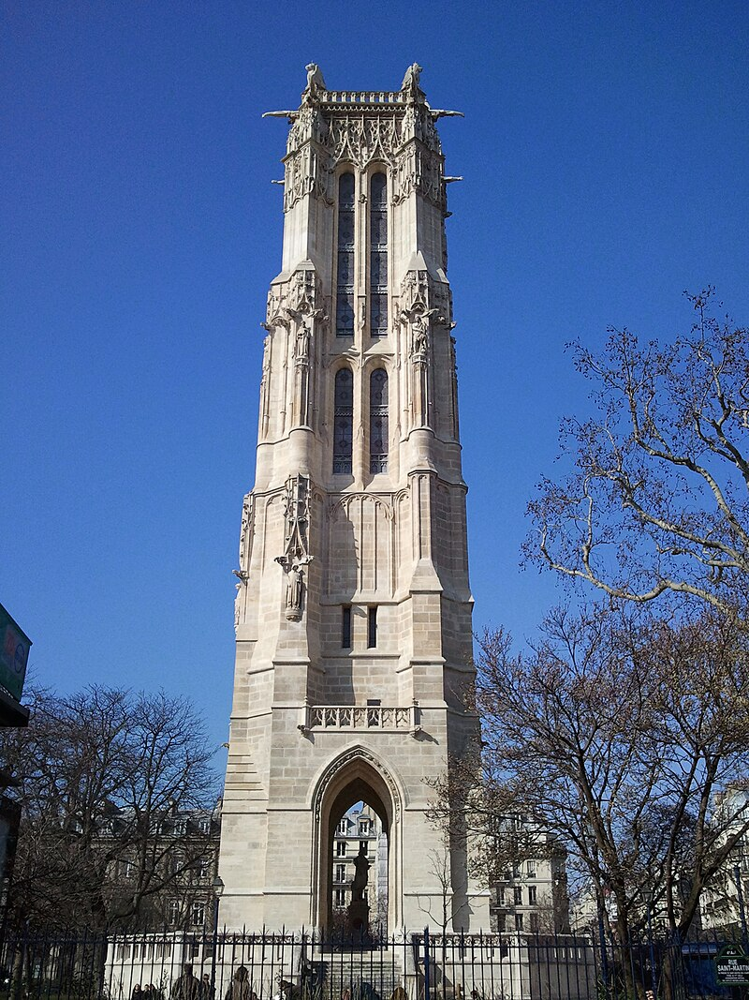

# Собор Парижской Богоматери, СЧ-2
## Книга третья
## I. Собор Богоматери

[youtube 2018 dji mavic](https://www.youtube.com/watch?v=4se3Q4ugKz8)  
[youtube](https://www.youtube.com/watch?v=NyxCLRot3zg)

  
  
   

[элементы собора](https://yandex.ru/images/search?from=tabbar&isize=large&lr=45&aabrnd=475779672&nomisspell=1&text=%D1%81%D0%BE%D0%B1%D0%BE%D1%80%20%D0%BF%D0%B0%D1%80%D0%B8%D0%B6%D1%81%D0%BA%D0%BE%D0%B9%20%D0%B1%D0%BE%D0%B3%D0%BE%D0%BC%D0%B0%D1%82%D0%B5%D1%80%D0%B8%20%D1%8D%D0%BB%D0%B5%D0%BC%D0%B5%D0%BD%D1%82%D1%8B)

>  
>А если мы войдем в самый собор, то кто снес колоссальное изображение [святого Христофора](https://ru.wikipedia.org/wiki/%D0%A5%D1%80%D0%B8%D1%81%D1%82%D0%BE%D1%84%D0%BE%D1%80_%D0%9B%D0%B8%D0%BA%D0%B8%D0%B9%D1%81%D0%BA%D0%B8%D0%B9), 
>так же славившееся среди других статуй, как славился большой зал **Дворца правосудия** среди других зал и **острие колокольни Страсбургского собора** среди всех прочих колоколен?  
>  

### Христофор:

Христофо́р (от греч. Χριστόφορος — «носящий Христа»; III век, Ханаан — около 251, Анатолия) — мученик, 
почитаемый Католической и Православной церквями, живший в III веке (либо на рубеже III—IV веков).

С XVIII в. Христофор изображается только в образе человека. 

О св. Христофоре Псеглавце существует множество легенд. 
[Святой Христофор Псеглавый — почему мученика изображали с головой собаки?](https://dzen.ru/a/ZmwP91BGZnclgNKh)

##### ыы:
  

##### The statue of St. Christopher in Notre Dame:

### Дворец правосудия:
_p321_Palais_de_Justice.jpg "Дворец правосудия")  

### Острие колокольни Страсбургского собора:
[youtube drone](https://www.youtube.com/watch?v=8K1nCvUgy8Y)  
  

>А кто заменил древний готический алтарь, так роскошно обставленный драгоценными ковчежцами и раками для мощей, 
этим тяжелым мраморным саркофагом, украшенным головами ангелов и облаками, который гораздо более подходит к 
**церкви Валь де Грас** или **Дому Инвалидов** ?  

### Валь де Грас:
[youtube](https://www.youtube.com/watch?v=SqtHTKvq4vg)  
  
  
_Val-de-Grâce_Église_Notre-Dame_Coupole_03.JPG "купол церкви Валь де Грас")   

### Дом Инвалидов:
[youtube](https://www.youtube.com/watch?v=PZF8Tj33nHI)  
   
  

##### эту цитату можно пропустить..
>Так чудное искусство, созданное вандалами, было убито академиками. К действию веков и революций, производивших опустошения, по крайней мере, с величавым беспристрастием, присоединилась туча патентованных, присяжных и дипломированных зодчих из академий, которые принялись с разборчивостью дурного вкуса разрушать все, что было сделано до них, и переделывать по-своему, заменяя, например, готическое резное кружево нелепыми завитушками времен Людовика XV, якобы во славу Парфенона. Это было ударом ослиного копыта умирающему льву. Это можно также сравнить со старым засыхающим дубом, на который набросились гусеницы, чтобы скорее источить и уничтожить обессилевшего исполина.  
  

>Как это далеко от того времени, когда Роберт Сенлис, сравнивая собор Парижской Богоматери со знаменитым **храмом Дианы в Эфесе**, 
«столь прославляемым языческими писателями», с храмом, который обессмертил Герострата, нашел галльский собор «превосходящим по длине, ширине, высоте и построению»  

>В общем, собор Парижской Богоматери не может быть назван памятником цельным, вполне законченным, классифицированным. 
Это уже не романская церковь, но еще и не вполне готическая. Словом, это не тип. 
В этом соборе нет того, чем отличается [Турнюсское аббатство]( https://commons.wikimedia.org/wiki/Category:Abbaye_Saint-Philibert_de_Tournus): 
массивной и величавой квадратной формы, круглого и широкого свода, нет той величественной простоты, которыми отличаются здания, сооруженные по принципу полной дуги. 
Он не похож на [собор в Бурже](https://en.wikipedia.org/wiki/Bourges_Cathedral) – легкий, разнообразный, сжатый, уносящийся ввысь, колосящийся таким множеством стрелок  

### Турнюсское аббатство:
[youtube](https://www.youtube.com/watch?v=_rJH_cVk7r0)  
  

### Собор в Бурже:
[youtube drone](https://www.youtube.com/watch?v=Iy2AQG_2fPQ)  
[youtube ](https://www.youtube.com/watch?v=FI14FNMCNV4)  
  

### Храм Дианы в Эфесе:

[youtube](https://www.youtube.com/watch?v=OkJz-voxOeA&t=565s)  
  
  

Останки храма Артемиды из Эфеса можно найти в Турции, в городе Сельчук, провинции Измир.  Однако все, чем могут полюбоваться наши современники на земле древней Эллады, - это одна уцелевшая колонна. 

Храм Артемиды в Эфесе — четвёртое чудо света. Это грандиозное сооружение было посвящено Артемиде, греческой богине охоты, дикой природы и плодородия. 1

Строительство храма началось в середине VI века до н. э. по приказу лидийского царя Креза. Проектом руководил архитектор Херсифрон, а завершение работ пришлось на 550 год до н. э.. 1

Размеры храма были впечатляющими: длина составляла около 115 метров, ширина — 55 метров. Храм окружали 127 колонн высотой около 18 метров, каждая из которых была украшена рельефами и скульптурами. 

Центральная часть храма, наос, содержала статую Артемиды, выполненную из дерева и золота, которая была объектом поклонения. 1

Храм был не только архитектурным чудом, но и важным религиозным центром. Артемида почиталась как защитница города и дарительница плодородия. Паломники приносили дары и жертвы, надеясь на благословение богини. Храм также служил местом хранения сокровищ и архивов, выполняя роль своего рода банка и хранилища ценностей. 1

Храм неоднократно подвергался разрушениям.  Одно из самых известных разрушений произошло в 356 году до н. э., когда Герострат поджёг храм, стремясь таким образом увековечить своё имя.  Позднее храм был восстановлен, но окончательно разрушен в III веке н. э. готами. Со временем руины были поглощены землёй и заброшены. 

Сегодня достопримечательность под названием «храм Артемиды» — лишь руины и одна из остановок экскурсионных маршрутов по античному городу Эфесу.

[источник](https://wikiway.com/turkey/khram-artemidy-v-efese/)  

Здание прекрасного храма Артемиды, построенного в 450 году до нашей эры спалил некий Геростат в 356 году до нашей эры, желая этим поступком увековечить себя в истории.

По преданию храм сгорел в ночь, когда родился Александр Македонский.

Именно этим и объяснялось, почему могущественная Артемида не смогла уберечь свой собственный храм. Она якобы помогала в это время при родах будущего покорителя Азии. И божественный Александ Македонский помог богине отстроить нововый храм, который и был построен на его деньги, через 30 лет.

Именно этот второй храм и считался, одним из 7 чудес Света.

Он был полностью уничтожен христианами в 4–5 веках при византийцах. Для новой христианской религии было очень важно разрушить святилище Великой Матери (Артемиды), так как ее культ был главным конкурентом христианства в Малой Азии.

Когда в Константинополе возводили собор святой Софии (VI в.), его украсили колоннами античных храмов, которые собирали по всей империи.
Теперь 12 колонн из этого храма можно увидеть в Константинополе в храме [Святой Софии](https://www.tourister.ru/responses/id_37493).
Храм Артемиды был обнаружен в 1889 году английским археологом Джоном Вудом.

[источник 2](https://www.tourister.ru/responses/id_25590)  

### Храм Святой Софии:
  

>Чтобы отметить лишь главные детали, укажем, для примера, на **Малые Красные двери**, которые своей отделкою почти достигают 
тонкостей готического зодчества пятнадцатого столетия, и на столбы притвора, напоминающие своими размерами аббатство 
**Сен-Жермен-де-Пре** времен Карловингов. Можно подумать, что между этими дверями и столбами лежит промежуток в шесть веков.
Даже сами герметики в символических украшениях главной паперти должны найти вполне удовлетворительный образчик их науки,
в таком совершенстве выразившийся во всем здании церкви **Сен-Жак-де-ла-Бушри**. 

### Малые Красные двери:

  
  

### Аббатство Сен-Жермен-де-Пре времен Карловингов:  

Аббатство Сен-Жермен-де-Пре — бывшее бенедиктинское аббатство в Париже, основанное в 541 году королём Хильдебертом I из династии Меровингов.  
В 861 году аббатство было сожжено викингами.  

От аббатства сохранилась лишь главная церковь, считающаяся самой старой в Париже. 
Четыре нижних яруса колокольни, неф и трансепт храма относятся к романскому стилю (конец X — начало XII века). 
Хор середины XII века — один из первых по времени создания памятников готического стиля, ставший вехой в его становлении. 

[ЖЖ — Аббатство Сен-Жермен-де-Пре: раскрашенная готика.](https://ru-travel.livejournal.com/24776176.html)

[youtube 360](https://www.youtube.com/watch?v=-l_6nJwgdq0)  
  
  

### Церковь Сен-Жак-де-ла-Бушри:

Церковь Сен-Жак-ла-Бушери (Église Saint-Jacques-la-Boucherie) , посторенная в 12 веке на средства гильдии мясников ("бушри" - мясная лавка), 
была разрушена в эпоху Великой французской революции. 
Уцелела лишь её колокольня, которая теперь именуется башней Сен-Жак.

С церковью Сен-Жак-де-ла-Бушери связано имя знаменитого французского учёного, Блеза Паскаля. Именно на этой колокольне он проводил опыты, изучая земное притяжение.

В средние века в Париже существовал обычай, преступник, убегающий от преследования, мог постучаться в двери церкви и получить убежище.

прототип Квазимодо из романа Виктора Гюго был звонарём не в соборе Парижской Богоматери, а в церкви Сен-Жак-Ла-Бушри и поднимался на башню Сен-Жак, чтобы звонить в колокола. 

[youtube](https://www.youtube.com/watch?v=qDPpestDGM0)

  
  
  

>Слой романский, самый древний, нижний, выражается круглым сводом, вновь появляющимся перед нами в верхнем, новейшем слое, 
подпираемом греческими колоннами. Между нижним и верхним слоями находится слой стрельчатого свода. 
Здания, принадлежащие исключительно одному из этих трех слоев, ярко разнятся между собою и являются вполне цельными и законченными. 
Возьмем, например, **Жюмьежское аббатство**, **собор в Реймсе**, **церковь Святого креста в Орлеане**. 
Но все эти три слоя смешиваются и сливаются по краям, как цвета в солнечном спектре. 
Отсюда возникли составные здания с оттенком перехода. Они являются романскими по своему основанию, готическими в середине, греко-римскими в верхней своей части. 
Это значит, что они строились в продолжение целых шестисот лет. Это разновидность редкая. Образчиком такого здания служит **башня замка д’Этамп**.  

### Жюмьежское аббатство:

Аббатство пережило многовековую историю, включая сожжение дотла викингами и использование в качестве темницы для врагов короля Карла Великого. 
Оно было оставлено в руинах во время Французской революции.

Даже в своем нынешнем состоянии оно является одним из самых красивых памятников архитектуры романского стиля. 

главная церковь аббатства, перестраивалась в 12-м и реставрировалась в 16-м веках. 

якобы Виктор Гюго часто приезжал сюда, называя аббатство самыми красивыми руинами Франции

[youtube](https://www.youtube.com/watch?v=TxeQGXdoJUs)

  
  
  

### Реймсский собор: 

Реймсский собор (фр. Notre-Dame de Reims) — готический собор во французском городе Реймсе. 

Был построен в основном в 1208–1311 годах (возведение башен затянулось вплоть до 1460 года) на месте более раннего собора V века, в котором состоялось крещение франкского короля Хлодвига I. 

Со времён раннего Средневековья до XIX века собор был местом коронации практически всех французских монархов. 

Серьёзно пострадав в годы Первой мировой войны, собор был восстановлен, однако утратил часть оригинальных витражей и скульптур. С 1991 года он входит в список Всемирного наследия ЮНЕСКО. 

Отличительными чертами собора являются ярко выраженное доминирование вертикальных линий и обилие статуй, украшающих фасады: их количество составляет 2303. Среди них наиболее известен так называемый «улыбающийся ангел», ставший одним из символов города Реймса.

[youtube](https://www.youtube.com/watch?v=0eURrZSvnv0)
[ЖЖ — Пристанище нечисти, королей и супергероев. Реймсский собор. ](https://morseanen.livejournal.com/86018.html)

  
  

### Церковь Святого креста в Орлеане:

Современный готический собор был заложен французским королём Генрихом IV и Марией Медичи, после того как старую романскую 
церковь в 1568 году взорвали гугеноты. Здание продолжали строить с 1601 по 1829 год. 8 мая 1829 года, к 400-летию снятия 
английской осады Орлеана армией Жанны д’Арк, король Карл X торжественно открыл новый собор

Пятинефный собор имеет в плане форму латинского креста. 
Высота центрального нефа — 32 метра, башен главного фасада — 82 метра, шпиля над средокрестием — 114 метров. 
Ярким украшением здания являются многочисленные витражи

[youtube 360°](https://www.youtube.com/watch?v=_4kBntxPUic)  
[ЖЖ — Собор Святого Креста, Орлеан](https://spratto.livejournal.com/12834.html)  

  
  
  

 
 
 

>Более часто встречаются памятники двух формаций. К ним принадлежит собор Парижской Богоматери – здание стрельчатое, 
внедренное своими круглыми столбами в романский слой, в котором всецело находятся 
главная паперть церкви **Сен-Дени** и притвор церкви **Сен-Жермен-де-Пре**. 
Такого же рода и прекрасный полуготический монастырский зал **Лошервиля**, до половины коренящийся в романском слое. 
Двойствен и кафедральный **собор в Руане**, который был бы вполне готическим, если бы конечность его шпиля не уносилась в слой эпохи Возрождения.  

  
  
  

### Аббатство Сен-Дени 

Аббатство Сен-Дени — один из главных национальных историко-культурных памятников Франции, 
который расположен в индустриальном районе северного пригорода Парижа. 
Это первый в мире католический собор, построенный в готическом стиле

[youtube drone](https://www.youtube.com/watch?v=z8reSgcN-zk)  
  
  

### Ле-Лошёр:

видимо оно: 
  
  
  
  

### Руанский собор:

(фр. Cathédrale Notre-Dame de Rouen, Собор Руанской Богоматери) — готический католический собор в городе Руан. 
Кафедральный собор архиепископа Руана и Нормандии. 
Строительство: начали возводить в 1145 году, строительство продлилось до 1506 года. 
Высота: 151 метр.

  
[youtube drone](https://www.youtube.com/watch?v=UoYlinCbkdo)
